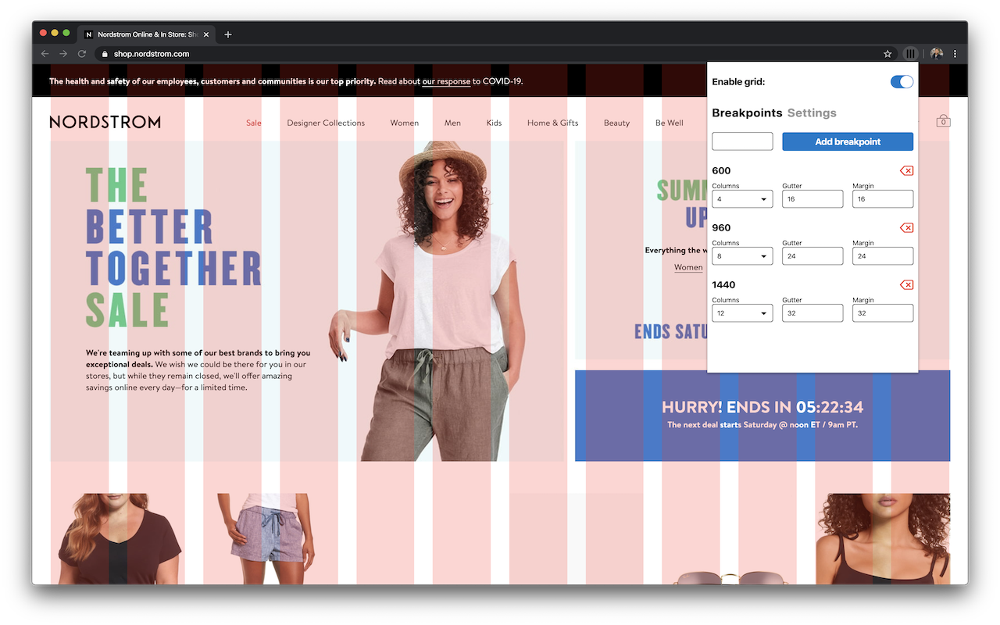
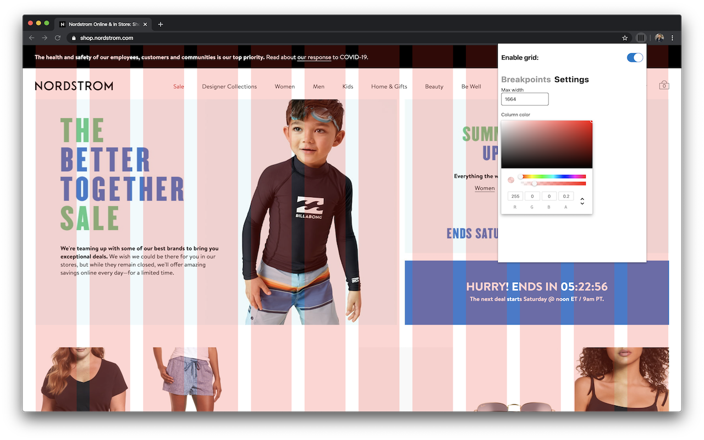
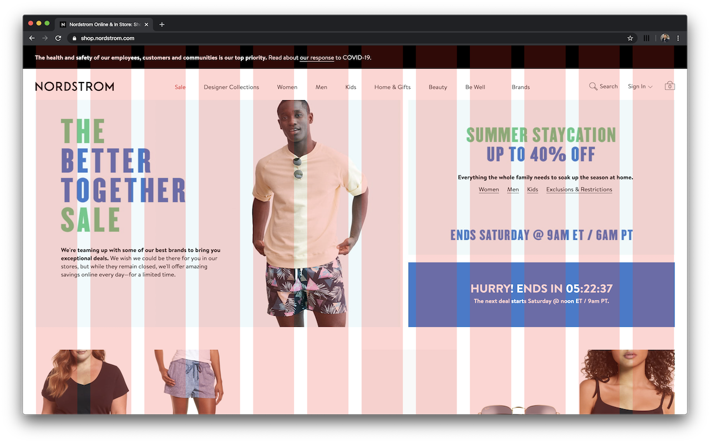

# Design Column Overlay

This chrome extensions places an overlay over the current tab so that web engineers can follow configured visual guidelines

## Installation

Install dependencies

`$ yarn`

Build app and content script

`$ yarn build`

Open Chrome Extension page `chrome://extensions/`

Load `/build` folder through the "Load unpacked" option
